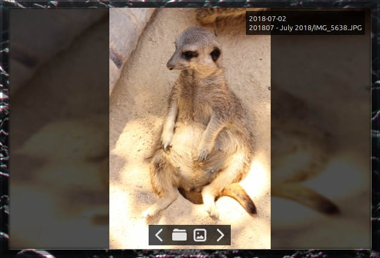
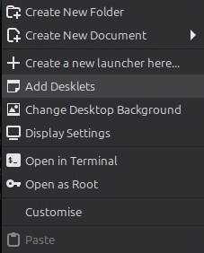
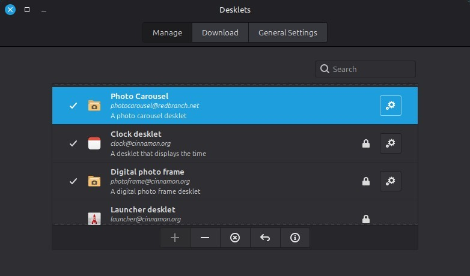
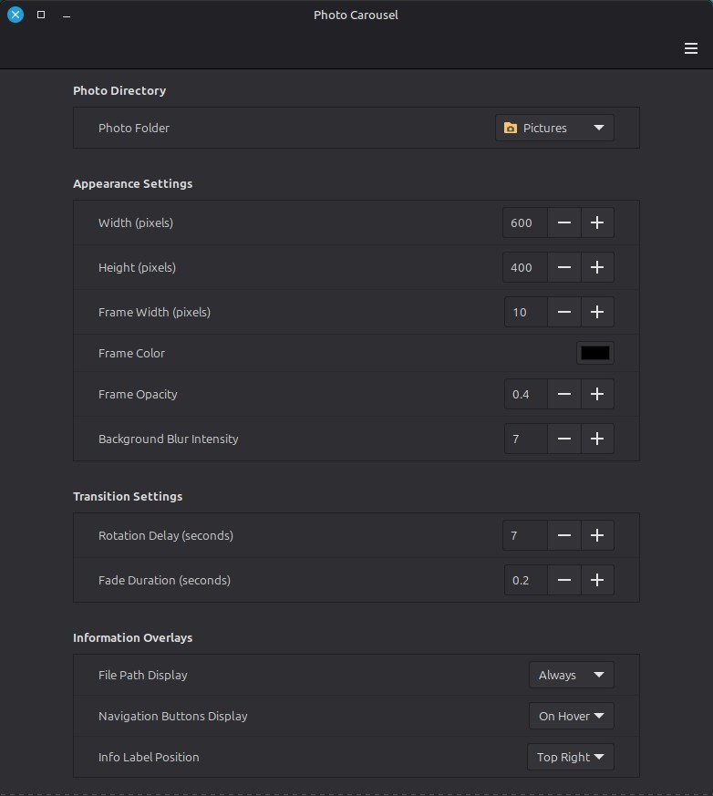

# photocarousel-desklet

An enhanced photo album desklet for the Cinnamon desktop



## Installation

To use this photo album on Linux Mint, or similar cinnamon desktop, download the code in this repo and copy the contents to:

```
~/.local/share/cinnamon/desklets
```

Example command line commands:

```
wget -O photocarousel-desklet.zip https://github.com/jonnymccullagh/photocarousel-desklet/archive/refs/heads/main.zip
unzip photocarousel-desklet.zip
cp -R photocarousel-desklet-main/photocarousel@redbranch.net ~/.local/share/cinnamon/desklets
```

Restart your desktop by logging out and back in again.

If you want to also make use of Exif info in your photos (dates, location, description) install `gexiv` with:

```
sudo apt install gir1.2-gexiv2-0.10
```

## Configuration

Once the desklet files are in place you can add the desklet to your desktop by right-clicking the desktop and choosing 'Add Desklets'.



There are many options available for the desklet and you can find them by choosing the cog icon in the Desklets window:



You can also reach the options by right-clicking the desklet on the desktop and choosing 'Configure':


The settings for the desklet can then be configured, beginning with the folder containing your photos:



For performance I would recommend using a local folder rather than a network share as the source of photos. I noticed some system slowdown when using larger files pulled from a NAS.

## Features

Most of the features are optional and can be switched on or off from the desklet settings.

- Displays portrait photos without stretching
- Navigation icons to allow returning to a previously displayed photo
- Rotation will pause on the current photo when the mouse pointer hovers over the photo
- Icon to open the photo in the File Manager
- Icon to open the photo in the system default image viewer
- Configure limits to improve performance
- Can display the file name and path of the photo
- Can display an icon to open a map of the photo location

## Troubleshooting

If you have any issues you should be able to see the logs from the desklet in the file:

```
~/.xsession-errors
```
